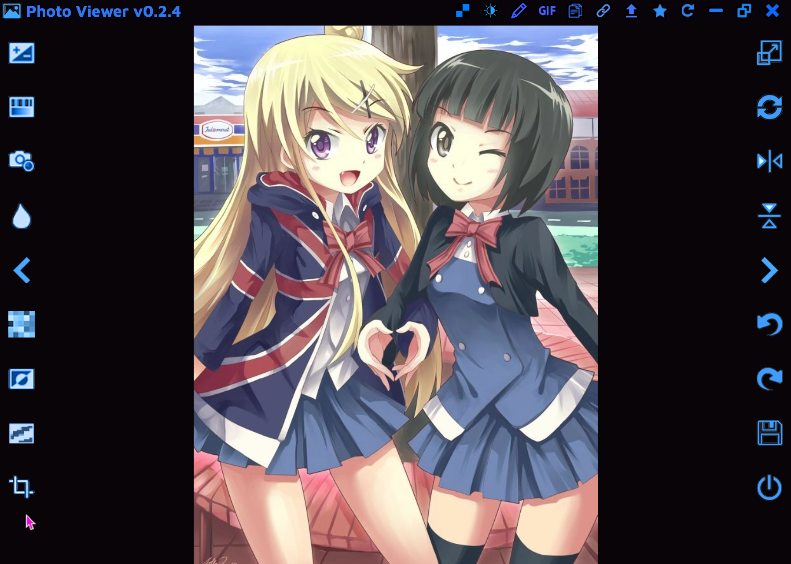

## Photo Viewer

This is a photo/GIF viewer with support for many cool resizing and color effects.

### Features:
- View images (PNG, JPG, WEBP, SVG, TIFF) and animated GIFs
- Support for local files, links, and images on the clipboard
- Brightness/Contrast adjustment
- Hue/Saturation/Lightness adjustment
- Tint adjustment
- Blur and Sharpen effects
- Pixelate effect
- Binarize effect
- Crop, resize, rotate, and flip transformations
- Undo and redo history states
- Open next and previous files (from the file system)
- Save images and GIFs with the applied effects

### Installation

Download the latest exe installer from the [releases](https://github.com/Tenpi/Photo-Viewer/releases) tab. Updates can be installed automatically.

### Bugs and Requests

Open an issue on my GitHub repository.

### Also See

- [Music Player](https://github.com/Tenpi/Music-Player)